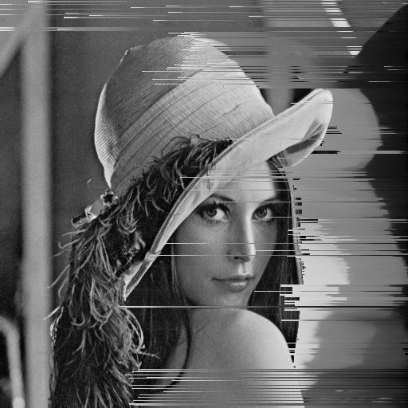

Pixsort: An artistic pixel sorting program
==========================================

The purpose of this script is to perform a &ldquo;pixel sorting&rdquo;
effect that purposefully perturbs an image in order to pretend that it
was damaged.

A simple sorting algorithm is used at present: after sharpening the
images, edges are detected and pixels are being sorted from the edge
with highest intensity&nbsp;(for every row of the image). This is not
the most sophisticated algorithm yet but it already yields some
interesting results.

Usage
-----

Use `-f` to indicate the fraction of all rows of the image that should
be sorted. To glitch all rows, use `1.0`:

    $ ./pixsort.py -f 1.0 Images/Lena_small.jpg

If not specified differently with `-o`, the new image will be the
basename of the old image with plus `_sorted`. For this example,
the file name will be `Lena_small_sorted.jpg`. See below for the
results.

Examples
--------

<figure>
  
  <figcaption>Lena (original)</figcaption>
</figure>

<figure>
  
  <figcaption>Lena (sorted)</figcaption>
</figure>

Requirements
------------

- `PIL`

Future extensions
-----------------

- Permit sorting of columns as well
- Handle RGB images
- More algorithms for glitching an image
